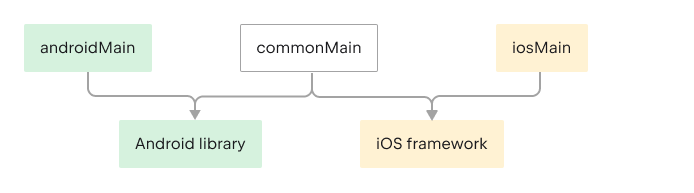

# Some useful links
- [Kotlin Multiplatform official document](https://kotlinlang.org/docs/multiplatform.html)
- [Kotlin Multiplatform project template creator tools](https://kmp.jetbrains.com/)
- [Jetpack Compose multiplatform offical document](https://www.jetbrains.com/help/kotlin-multiplatform-dev/compose-multiplatform-getting-started.html)
- [KMP samples](https://www.jetbrains.com/help/kotlin-multiplatform-dev/multiplatform-samples.html)
- [Sqldelight](https://cashapp.github.io/sqldelight/2.0.1/multiplatform_sqlite/)
- [KMP samples of To-Do](https://github.com/russhwolf/To-Do/)
- [Ktor client for HTTP](https://ktor.io/docs/create-client.html)
- [Ktorfit(Similar to Retrofit)](https://github.com/Foso/Ktorfit)
- [Compose imageloader(@seiko)](https://github.com/qdsfdhvh/compose-imageloader)
- [KMP Libraries](https://github.com/AAkira/Kotlin-Multiplatform-Libraries)
- [Voyager(KMP Jetpack compose Navigator)](https://github.com/adrielcafe/voyager)

# Environment
See [Official Document](https://www.jetbrains.com/help/kotlin-multiplatform-dev/compose-multiplatform-setup.html).
- Android Studio
- XCode
- JDK
- Kotlin Multiplatform mobile plugin
- kotlin plugin
- kdoctor(Optional)

# Create Project
It is recommended to use [template tools](https://kmp.jetbrains.com/) to create KMM projects.

# Project Structure




# Build

### Desktop
```
./gradlew :composeApp:run 
```
### iOS
Click XCode run button direct.

### Android
select composeApp and click Android Studio run button.

# Dependency
[This repository](https://github.com/AAkira/Kotlin-Multiplatform-Libraries) list some KMM libraries.


# generate by KMM

This is a Kotlin Multiplatform project targeting Android, iOS, Desktop.

* `/composeApp` is for code that will be shared across your Compose Multiplatform applications.
  It contains several subfolders:
  - `commonMain` is for code that’s common for all targets.
  - Other folders are for Kotlin code that will be compiled for only the platform indicated in the folder name.
    For example, if you want to use Apple’s CoreCrypto for the iOS part of your Kotlin app,
    `iosMain` would be the right folder for such calls.

* `/iosApp` contains iOS applications. Even if you’re sharing your UI with Compose Multiplatform, 
  you need this entry point for your iOS app. This is also where you should add SwiftUI code for your project.


Learn more about [Kotlin Multiplatform](https://www.jetbrains.com/help/kotlin-multiplatform-dev/get-started.html)…
